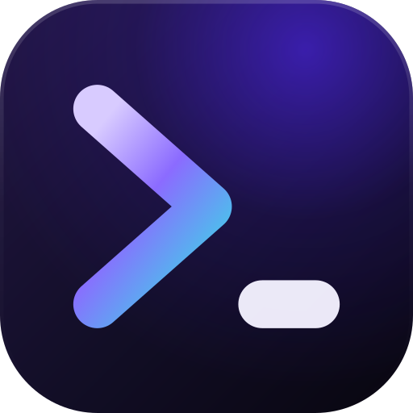

<div align="center">
  
  <h1>Nexis</h1>

  <p><strong>Open-source lightweight cross-platform AI-native terminal (ADE)</strong></p>

  <p>
    <a href="https://github.com/rwetz/Nexis/releases"></a>
    
    
  </p>

  <p>
    <a href="https://wiki.nexisdev.org">Wiki</a> ·
    <a href="https://github.com/rwetz/Nexis/releases">Downloads</a> ·
    <a href="CHANGELOG.md">Changelog</a> ·
    <a href="ROADMAP.md">Roadmap</a> ·
    <a href="CONTRIBUTING.md">Contributing</a>
  </p>
</div>

---

Nexis is a lightweight, AI-first terminal and developer environment built on Tauri 2, Rust, and React 19. Native PTY backend, multi-tab terminals, a full code editor, file explorer, source control, and an AI panel that runs on your own API keys — or entirely offline with LM Studio, MLX, or Ollama. Under 10 MB, keys stored in the OS keychain, zero telemetry.

This README is the short version. The **[wiki](https://wiki.nexisdev.org)** has the full story — [installation](https://wiki.nexisdev.org/installation/), [quick start](https://wiki.nexisdev.org/basics/quick-start/), [features](https://wiki.nexisdev.org/features/terminal/), [keybindings](https://wiki.nexisdev.org/configuration/keybindings/), [AI provider setup](https://wiki.nexisdev.org/configuration/ai-providers/), and [troubleshooting](https://wiki.nexisdev.org/troubleshooting/).

## Highlights

- **[Terminal](https://wiki.nexisdev.org/features/terminal/)** — xterm.js with WebGL rendering, unlimited tabs and split panes, native PTY (zsh, bash, pwsh, fish, cmd, WSL). Shell integration (cwd tracking, prompt markers, live tab titles), fuzzy shell-history search, private terminals the AI can't read, session recording, and read-only live sharing over LAN.
- **[Editor](https://wiki.nexisdev.org/features/editor/)** — CodeMirror 6 with highlighting for 20+ languages, AI inline autocomplete, per-hunk approval of AI-proposed edits, minimap, Vim mode, formatting on save, snippets, project-wide search and replace, and a fuzzy file picker.
- **[Language tooling](https://wiki.nexisdev.org/features/language-tooling/)** — real LSP servers (go-to-definition, hover, completion, diagnostics, rename, refactors), a DAP step-through debugger, and a problems panel.
- **[Source control](https://wiki.nexisdev.org/features/git/)** — stage, commit, and branch without leaving the app; commit graph, stash manager, merge-conflict resolver, worktrees, and AI-generated commit messages and PR descriptions.
- **[AI](https://wiki.nexisdev.org/features/ai-panel/)** — 12+ providers (OpenAI, Anthropic, Google, Groq, xAI, Cerebras, DeepSeek, Mistral, OpenRouter, Hugging Face, any OpenAI-compatible endpoint) or fully offline via LM Studio, MLX, and Ollama. Multi-agent workflows with tool approval, an agent task queue, semantic codebase search, voice input, prompt templates, and a context inspector that shows exactly what the model sees.
- **[ML Lab](https://wiki.nexisdev.org/ml-suite/)** — train small models on your own data, locally, with live charts, an inference playground, and run comparison. See [docs/ML_LAB_GUIDE.md](docs/ML_LAB_GUIDE.md).
- **[Themes](https://wiki.nexisdev.org/features/themes/)** — ten built-in themes, custom `.nexis-theme` files with live preview, and background images with opacity and blur.
- **Workbench** — file explorer, web preview for local dev servers, and sidebar panels for background jobs, ports, SSH connections, tests, databases, build tasks, and releases.
- **Private by design** — API keys live in the OS keychain (never on disk), AI tools run against an approval-gated sandboxed surface, SSRF and DNS-rebinding protection, and no telemetry of any kind.

## Install

Download the latest release for your platform from **[Releases](https://github.com/rwetz/Nexis/releases)**: macOS `.dmg`, Linux `.AppImage` / `.deb` / `.rpm` (plus an AUR package), Windows NSIS / MSI.

Per-platform notes (SmartScreen, FUSE, Wayland, WSL) live in the wiki: [Linux](https://wiki.nexisdev.org/installation/linux/) · [Windows](https://wiki.nexisdev.org/installation/windows/) · [macOS](https://wiki.nexisdev.org/installation/macos/).

## Setting up AI

1. Open **Settings → AI**
2. Choose a provider and paste your API key — it's stored in the OS keychain via Rust's `keyring` crate, never on disk
3. For local/offline models, point Nexis at your LM Studio, MLX, or Ollama URL — no key needed

Full provider list and configuration details: [AI providers](https://wiki.nexisdev.org/configuration/ai-providers/).

## Building from source

Prerequisites: [Rust](https://rustup.rs) (stable), Node 22+ with [pnpm](https://pnpm.io) 11+, and the [Tauri platform prerequisites](https://tauri.app/start/prerequisites/).

```bash
pnpm install
pnpm tauri dev        # dev with hot reload
pnpm tauri build      # production build
```

Tests and checks: `pnpm test` (Vitest), `cargo test` in `src-tauri/`, `pnpm exec tsc --noEmit`, `cargo clippy`. `pnpm test:e2e` runs the WebdriverIO E2E suite against a release build.

## Docs

Everything contributor-facing lives in **[docs/](docs/)**.

- **[Wiki](https://wiki.nexisdev.org)** — user documentation: installation, features, configuration, FAQ, troubleshooting
- **[docs/architecture/](docs/architecture/)** — how the internals work, in prose: the [two-process model](docs/architecture/two-process-model.md), [PTY & shell integration](docs/architecture/pty-shell-integration.md), the [terminal renderer pool](docs/architecture/terminal-renderer-pool.md), the [AI subsystem](docs/architecture/ai-subsystem.md), and the [security model](docs/architecture/security-model.md)
- **[docs/vault/](docs/vault/Home.md)** — a linked navigational map of the codebase (module maps, subsystem notes, flows, decisions)
- **[CHANGELOG.md](CHANGELOG.md)** — the canonical record of everything that shipped
- **[ROADMAP.md](ROADMAP.md)** — what's planned, and the hard limits on what won't be built
- **[docs/ML_LAB_GUIDE.md](docs/ML_LAB_GUIDE.md)** / **[docs/ML_SUITE.md](docs/ML_SUITE.md)** — ML Lab usage guide and architecture
- **[SECURITY.md](SECURITY.md)** — security posture and reporting

### Reading the vault in Obsidian

`docs/vault/` is an [Obsidian](https://obsidian.md)-compatible knowledge base — plain markdown with
`[[wiki-links]]` and YAML frontmatter, no plugins required. GitHub renders those links as literal text, so
it's worth opening properly: in Obsidian choose **Open folder as vault** and point it at `docs/vault/`
inside your checkout (not the repo root). `Home.md` is the entry point, and the graph view shows how the
subsystems connect. Obsidian's per-user config goes in `docs/vault/.obsidian/`, which is gitignored.

Prefer not to install anything? Every note reads fine in any editor, and the prose guides in
[docs/architecture/](docs/architecture/) are plain markdown that renders correctly right here on GitHub.

## Credits — built on Terax

Nexis began as a personal fork of **[terax-ai](https://github.com/crynta/terax-ai)**, an open-source
AI-native terminal by **[@crynta](https://github.com/crynta)**. The foundations Nexis inherited from that
project — the PTY session architecture, the shell-integration approach, and the original AI tooling layer
— shaped everything that came after, and several later designs (the renderer-pool memory work among them)
were informed directly by upstream's own fixes.

Nexis has since taken its own direction, branding, and a substantially expanded feature set, but the
lineage is real and worth stating plainly. If you find Nexis useful, go give
[terax-ai](https://github.com/crynta/terax-ai) a look and a star.

Nexis is Apache-2.0, as is the upstream work it builds on.

## Stack

Tauri 2 · Rust · `portable-pty` · React 19 · TypeScript · xterm.js · CodeMirror 6 · Vercel AI SDK v6 · Tailwind v4 · shadcn/ui · Zustand

## Contributing

PRs and issues are welcome. Check [CONTRIBUTING.md](CONTRIBUTING.md) before opening anything non-trivial, and see the [good-first-issue](https://github.com/rwetz/Nexis/labels/good-first-issue) and [help-wanted](https://github.com/rwetz/Nexis/labels/help-wanted) labels for tracked tasks.

## License

Apache-2.0. See [LICENSE](LICENSE).
