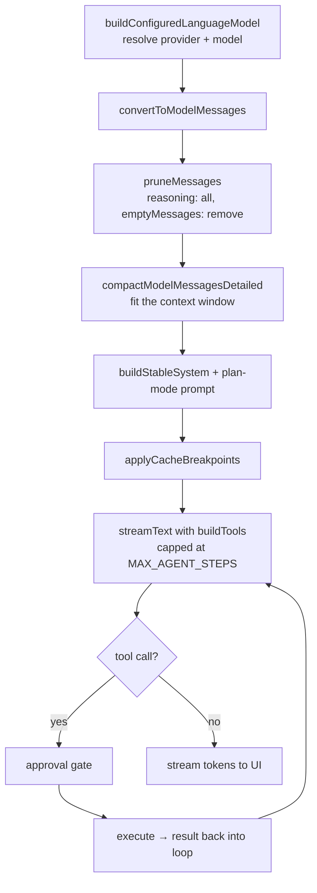

# The AI subsystem

Nexis's AI panel is an agent, not a chat box: it reads files, edits them, runs commands, searches the
codebase, and delegates to subagents. Nearly all of that logic lives in the **frontend** (`src/modules/ai/`),
built on the [Vercel AI SDK](https://sdk.vercel.ai). Rust participates in only two roles — HTTP proxy and
tool executor.

That split is intentional. Prompt assembly, tool orchestration, and compaction are product logic that
changes weekly; PTY handling and keychain access are not. Keeping the agent in TS means iterating without
a Rust rebuild, and keeping the capabilities in Rust means the agent can't reach past the command surface.

## One turn, end to end

`lib/agent.ts:runAgentStream` is the single entry point for a chat turn. The order of the pipeline is not
arbitrary:

**Pruning must precede compaction.** Reasoning/thinking blocks from prior turns are stripped before the
history is measured or trimmed. Two reasons: Cerebras *rejects* messages containing them outright, and
every other provider silently counts them against the context budget — so leaving them in makes
compaction discard real conversation to make room for text the model won't use. This is
[pitfall #3](../../CLAUDE.md).

**Compaction is defensive about tool output.** Byte estimation goes through `safeJsonLength` rather than
raw `JSON.stringify`, because tool results are untrusted objects that can contain circular references. An
unhandled `TypeError` here kills the turn and every subsequent one ([pitfall #11](../../CLAUDE.md)).

**Cache breakpoints go on last**, after the system prompt is assembled, so the stable prefix is actually
stable across turns and providers can serve it from cache.

### Providers

`buildConfiguredLanguageModel` resolves both cloud providers (OpenAI, Anthropic, Google, Groq, xAI,
Cerebras, DeepSeek, Mistral, OpenRouter, Hugging Face, any OpenAI-compatible endpoint) and local runtimes
(LM Studio, Ollama, vLLM, MLX, SGLang, xLLM). Local endpoints need no key.

All provider HTTP goes through `lib/proxyFetch.ts` → Rust `ai_http_request` / `ai_http_stream` in
`net.rs`, never browser `fetch`. This dodges CORS entirely, keeps API keys out of webview network state,
and — most importantly — puts every outbound request behind the SSRF and DNS-rebinding checks described in
[security-model.md](security-model.md#outbound-http). Streaming comes back over a `Channel<AiStreamEvent>`.

## Tools

`tools/tools.ts:buildTools` composes seven families — **fs, edit, search, shell, subagent, terminal,
todo** — all sharing a `ToolContext` (`tools/context.ts`) that owns `resolvePath`. Centralizing path
resolution is what lets a single place enforce that the agent can't wander outside the workspace.

Execution that needs real capabilities crosses into Rust via `lib/native.ts`, the AI's bridge to the
`fs_*`, `git_*`, `shell_*`, `lsp_*`, and `dap_*` command families.

One implementation detail with a history: `tools/shell.ts` memoizes per-session shells in `sessionShells`.
Its `.catch()` handler deletes the map entry before re-throwing, and that eviction is load-bearing. A
rejected promise cached in a `Map` is indistinguishable from a resolved one until awaited — without the
eviction, one failed `bash_run` (a cwd that didn't exist yet, say) poisons every subsequent shell call for
the rest of the session, long after the cause is gone ([pitfall #10](../../CLAUDE.md)).

## Tool approval

Every tool call passes an approval gate before it executes. Policies are per-tool, stored in the
`toolApprovalPolicies` preference and edited in Settings → Agents:

| Policy | Behavior |
|---|---|
| `prompt` | Ask the user every time. **Default.** |
| `auto` | Execute without asking. |
| `deny` | Refuse. |
| `auto-safe` | `bash_run` only — auto-approve if the command passes a strict read-only check. |

`auto-safe` is the interesting one, and it is deliberately paranoid. `checkAutoApprove` in
`lib/security.ts` admits a command only if it clears *all* of: a curated binary allowlist (plus read-only
git subcommands), no shell metacharacters anywhere, and every path argument passing `checkReadable` —
including values inside `--flag=value` forms and the path half of git's `rev:path` colon syntax. Anything
it can't fully parse is rejected rather than assumed benign.

Dispatch happens in `AiChat.tsx`'s `RenderedTool` via `resolveApprovalPolicy` (also `lib/security.ts` —
pure and unit-tested). `auto-safe` configured on any tool other than `bash_run`, or against a non-string
command, **degrades to `prompt`** rather than to `auto`. Fail-closed is the rule throughout.

Audit entries record how each call passed the gate (`approval: user | auto | auto-safe`), recomputed from
the live policy in `tools/shell.ts`. Note this is advisory: the SDK's execute path can't observe who
actually answered the prompt.

## Subagents

`agents/runSubagent.ts` runs typed subagents defined in `agents/registry.ts` — read-only fs and search
tools only, `generateText` rather than a stream, capped at 12 steps.

Subagents receive **a single prompt string with no message history**, which is why `runSubagent` doesn't
call `pruneMessages` — there's nothing to prune. If subagents ever gain conversation history, pitfall #3
applies to them immediately and that call has to be added.

## Supporting pieces

- `lib/keyring.ts` — API keys in the OS keychain via `secrets_*`; cross-window change signal is
  `nexis://ai-keys-changed`.
- `lib/security.ts` — hardened path checks. It keeps a **deliberately private `basename`** implementation;
  do not consolidate it into `src/lib/path.ts`. It's a hardened comparison surface and the explicit
  exception to [pitfall #12](../../CLAUDE.md)'s no-local-path-helpers rule.
- `lib/redact.ts` — secret redaction · `lib/sessions.ts` — chat persistence · `lib/todos.ts` — agent todo
  state · `lib/slashCommands.ts`.
- `lib/nlCommand.ts` — natural language → shell command for the terminal's AI command bar
  (`terminal/components/AiCommandBar.tsx`). **Insert-only contract:** `sanitizeCommand` rejects multi-line
  and control-character suggestions, because the result is written into the PTY input line where a stray
  `\r` would execute it without the user ever pressing Enter. Keep it strict.
- `store/` — five Zustand stores; `chatStore.ts` is the large one (messages, streaming state, `isBusy`,
  sessions).

## Gotchas

**Never re-add `disabled={c.isBusy}` to the composer textarea** (`components/AiInputBar.tsx`). React
re-rendering the element as disabled fires a blur, and on Windows that steals keyboard focus the moment an
agent turn starts — the user loses their cursor mid-sentence. The Enter-to-submit path already guards
against double-submit via `c.isBusy`. Indicate busy state with CSS, not `disabled`
([pitfall #5](../../CLAUDE.md), tripwired).

**Zustand selectors must return stable references.** This applies app-wide but bites hardest around the AI
stores, which update frequently. A selector containing an inline `.filter()`, `.map()`, or object spread
returns a new reference every call, `Object.is` fails, and `useSyncExternalStore` loops forever — blank
screen, "Maximum update depth exceeded". Select the stable reference and derive in the render body, or use
`useShallow` ([pitfall #14](../../CLAUDE.md)).

## Related

- Vault: [ai](../vault/subsystems/ai.md) · [ipc-surface](../vault/maps/ipc-surface.md) · [zustand-stores](../vault/maps/zustand-stores.md)
- Guides: [security-model.md](security-model.md) · [two-process-model.md](two-process-model.md)
- Invariants: [CLAUDE.md](../../CLAUDE.md) pitfalls #3, #5, #10, #11, #12, #14
