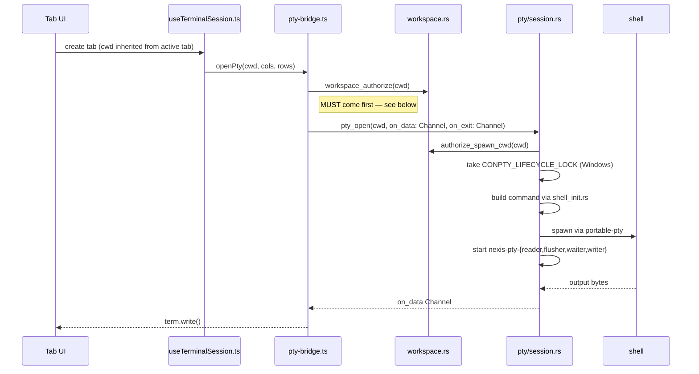
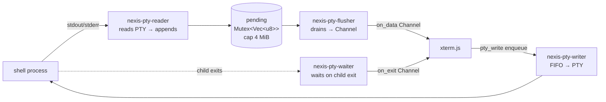

# PTY and shell integration

The terminal is the oldest and densest subsystem in Nexis, and the one with the most invariants per line
of code. This is the guide to how a keystroke becomes a byte in a shell and how the shell's output
becomes pixels — plus the shell-integration layer that turns a dumb byte stream into structured knowledge
about what the user is doing.

## Opening a session

**The authorization step is load-bearing and easy to lose.** `pty_open` calls `authorize_spawn_cwd`, which
rejects any cwd not under an authorized workspace root. A user who `cd`s to another drive and opens a new
tab hands `pty_open` a path it will refuse — so `openPty` pre-authorizes. Skip that call and you get a
terminal that renders a cursor and nothing else, with the error swallowed in a `.catch()`. Any *new* code
path that opens a PTY with a user-supplied cwd — tab restore, split pane, deep link — has to do the same.
This is [pitfall #1C](../../CLAUDE.md).

## Thread topology

Each session runs four named threads (`nexis-pty-*`, greppable in logs) around one shared buffer:

**Why a flusher at all:** reading and forwarding on the same thread would send one IPC message per read
syscall. The flusher coalesces bursts into batches, which is the difference between a smooth `cat
bigfile` and a stuttering one.

**Backpressure.** `pending` is capped at `MAX_PENDING` (4 MiB). If xterm.js falls behind — a hidden pane,
a slow renderer, a firehose of output — the buffer fills and is *discarded* with a visible
`[nexis: dropped output due to backpressure]` notice. This is intentional: the alternative is unbounded
growth and an OOM. If a user reports missing output from a long-running command, this is the cause, and
the fix is a tradeoff (more memory) rather than a bug ([pitfall #7](../../CLAUDE.md)).

**Poison recovery.** All four threads share `pending`. If any one panics while holding the lock, the mutex
is poisoned, and a plain `.lock().unwrap()` in the others panics too — cascading into a permanently silent
terminal with no error shown. Every lock on `pending` therefore uses
`.unwrap_or_else(|e| e.into_inner())`, which recovers the data instead. Same for the `Condvar` wait. Any
new code sharing that `Arc` must do the same ([pitfall #8](../../CLAUDE.md)).

**A watchdog catches the rest.** Drop-guard sentinels on the reader and flusher flag thread death
(including panics), and a single global `nexis-pty-watchdog` thread reports a red in-terminal notice when
a thread has been dead more than five seconds without the waiter's clean `done` handoff. The notice goes
out over the session's own `on_data` channel, so it works even with both PTY threads dead. It deliberately
does *not* synthesize an exit event — that path auto-respawns and would kill a live child.

### Input ordering

Input has exactly one guarantee to preserve: **bytes arrive in the order the user typed them.** That's
harder than it sounds, because the naive implementations both break it.

- A direct `write_all` inside the command blocks the main thread whenever the child stops reading — a
  user who hits Ctrl+S freezes the whole app.
- A `spawn_blocking` per write doesn't block, but two rapid keystrokes can land on different pool threads
  and race.

The channel is what makes ordering total: `pty_write` is **sync and enqueue-only**, pushing onto a FIFO
that a per-session `nexis-pty-writer` thread drains. This also matters for correctness beyond typing —
device-query replies (DA/DSR/CPR) that xterm generates on the frontend ride the same `onData` →
`pty_write` path, so they can't interleave with keystrokes and corrupt an escape sequence.

Both halves are tripwired: `pty_write_stays_sync_and_enqueue_only` in `pitfall_invariants.rs`, and a
`pty_write` call-site confinement check in `pitfall-guards.test.ts`.

## The Windows ConPTY problem

Windows deserves its own section because it has failed in three distinct ways, all presenting identically
as *"new terminal opens blank — cursor visible, shell never prints."*

**1. The lifecycle race.** `CreatePseudoConsole` and `ClosePseudoConsole` must not run concurrently. An
overlapping close corrupts the newly created console: the child spawns but never pumps output. A single
`CONPTY_LIFECYCLE_LOCK` serializes both — `spawn()` holds it while creating, `drop_session()` while
dropping. `pty_close` must drop the session on a **detached thread** via `session::drop_session(s)`, never
an inline `drop(s)`.

**2. PowerShell's launch mode.** Launching with `-File profile.ps1 -NoExit` starts the shell in
script-execution mode and only then transitions to interactive. During that transition the ConPTY output
stream isn't fully initialized and the first prompt is silently dropped. The fix is to launch with
`-Command "if ($env:NEXIS_PWSH_PROFILE) { . $env:NEXIS_PWSH_PROFILE }"` and pass the profile path in an
environment variable — interactive from the first byte, and no path-quoting problems.

**3. Console flashes from unrelated subprocesses.** A GUI app has no console, so any `Command::spawn`
without `CREATE_NO_WINDOW` makes Windows create a temporary one. Visible as a black flash — and if a
ConPTY session is live at that moment, the console creation races with ConPTY I/O and can corrupt it. The
active terminal goes silent while the shell is still running.

That last one is why **`crate::modules::proc::command()` is the only sanctioned way to build a non-PTY
subprocess** — it pre-applies the flag. Raw `std::process::Command::new` fails CI twice over: once via
`disallowed-methods` in `clippy.toml`, once via the `pitfall_1d_command_new_only_in_proc_rs` tripwire.
PTY sessions are the exception; `portable_pty` sets the flag internally, so don't route them through
`proc::command`.

When a blank terminal is reported, [CLAUDE.md pitfall #1](../../CLAUDE.md) has the five-step
differential-diagnosis checklist. Always check the devtools console first — `[nexis] openPty failed:` is
logged on every `pty_open` error.

## Shell integration

A raw PTY gives you bytes. Shell integration gives you *structure* — where the prompt is, which bytes were
a command versus its output, what the cwd is, and whether the command failed. Nexis injects a small
profile script per shell (cached under `~/.cache/nexis/shell-integration/`) that emits OSC escape
sequences, parsed in `terminal/lib/osc-handlers.ts`.

| Sequence | Meaning | Used for |
|---|---|---|
| OSC 7 | current working directory | tab titles, new-tab cwd inheritance, git panel |
| OSC 133 A/B/C/D | prompt start / command start / output start / command end + exit code | exit-status gutter, command boundaries, failure detection, prompt-block navigation |
| OSC 0 / 2 | window title | live tab titles |
| OSC 52 | clipboard | **write-only**, pref-gated (see below) |

Two subtleties worth knowing:

**OSC 7 is gated by 133 state.** A cwd report that arrives while a command is running is untrusted — any
program can print escape sequences, so `cat` on a malicious file could otherwise redirect the user's next
tab. In-command OSC 7 is rejected. Importantly, a *rejected* OSC 7 deliberately does not set
`markersSeen`, because letting untrusted output flip that flag would disable the fallback below.

**OSC 52 reads are always blocked.** Clipboard *writes* are gated behind the `terminalOsc52Clipboard`
preference; clipboard *reads* are consumed silently and unconditionally. A terminal escape sequence that
can exfiltrate the user's clipboard is not a feature.

The `D;<nonzero>` marker also drives the failed-command **"✦ Explain" chip**: it captures the command and
output between the B/C markers and the cursor (tail-capped), and clicking dispatches a
`nexis:ai-explain-failure` event that App.tsx bridges into the AI composer. It skips exit 130 (Ctrl+C) and
stale-`$?` bare-Enter re-emits, which need a C marker or actual output as evidence a command really ran.

### When integration is missing

Not every shell cooperates — an unusual shell, a user profile that clobbers the injection, a remote
session. If no marker has arrived ~5 seconds after PTY open, `useTerminalSession.ts` logs once and starts
a 3-second `pty_cwd` poll: a `/proc/<pid>/cwd` readlink via the session's stored `child_pid`. It's
Linux-only — other platforms return `None` and the frontend keeps its last-known cwd. The poll cancels
itself the instant a real marker arrives, and both timers clear on dispose or respawn.

This rescues cwd tracking only. Without integration, the exit-status gutter, the "✦ Explain" chip, and
in-command OSC 7 spoof-gating stay unavailable — they have no fallback, because there's nothing to fall
back to.

### Profile caching gotcha

`write_if_changed` in `shell_init.rs` compares the embedded script against the cached file and skips the
write when identical. During development, that means editing something *other* than the script content —
or expecting a rebuild alone to refresh it — leaves the old profile in place. Delete the cached file
manually. Don't bypass `write_if_changed` with a direct write: the atomic tmp+rename it performs is what
stops a shell starting in parallel from sourcing a half-written file ([pitfall #6](../../CLAUDE.md)).

## Scrollback across restarts

Terminals survive app restarts. On exit, `useTabs`'s close handler mints per-tab snapshot ids, force-saves
tab state, and serializes each non-private terminal's active pane — live slots through the xterm serialize
addon, parked ones from the stored snapshot and dormant ring — writing through `snapshot-bridge.ts` to
`modules/snapshots.rs`, which does an atomic tmp+rename under `~/.cache/nexis/session-snapshots/`. A 1.5
second race caps how long exit can block on this.

On restore, the ordering is the whole trick: `sessionRestore.ts` registers leafId → snapshotId, and
`ensureSession` chains the snapshot load into `Session.ready` **before** attach binds the slot and opens
the PTY. That's what guarantees the replayed scrollback lands ahead of the first byte from the new shell,
rather than interleaving with it. Exit-time garbage collection keeps the snapshot directory from
accumulating orphans.

Private terminals are excluded by design — they aren't serialized at all.

## Related

- Vault: [pty](../vault/subsystems/pty.md) · [terminal-tab-open flow](../vault/flows/terminal-tab-open.md)
- Guides: [terminal-renderer-pool.md](terminal-renderer-pool.md) · [security-model.md](security-model.md)
- Invariants: [CLAUDE.md](../../CLAUDE.md) pitfalls #1, #4, #6, #7, #8, #9
