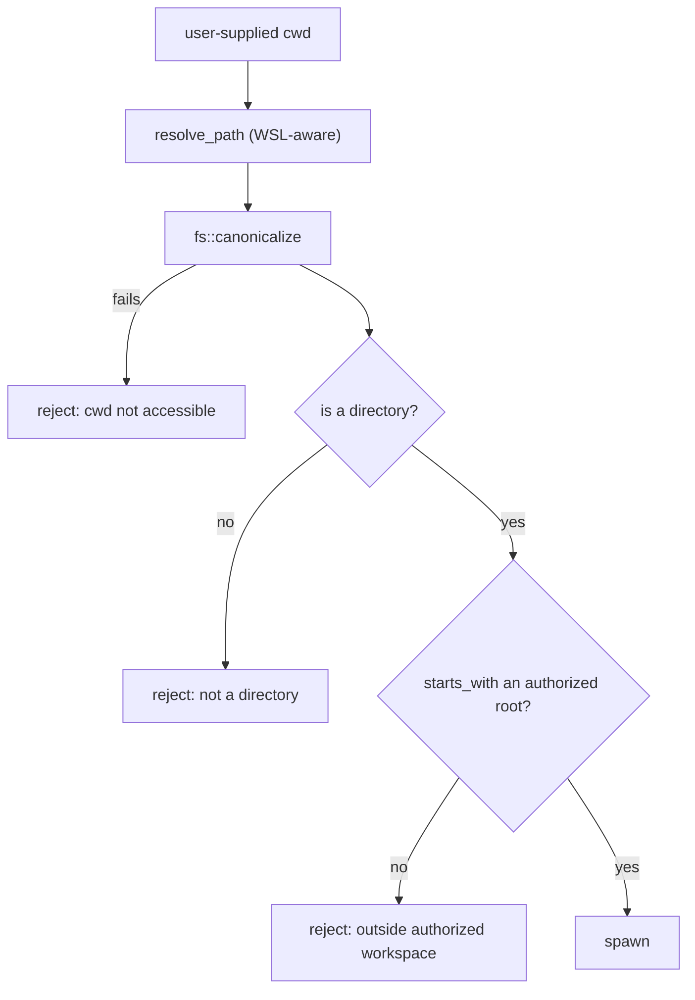

# Security model

Nexis runs a terminal, an AI agent with tool access, a local HTTP server, and outbound requests to
arbitrary provider endpoints — inside a webview. This document describes what is trusted, what is gated,
and where the boundaries actually sit.

For reporting a vulnerability, see [SECURITY.md](../../SECURITY.md).

## Threat model

What we defend against:

- **Untrusted content rendered in the terminal.** `cat` on a hostile file, output from a compromised
  build, a malicious dependency's install script. Terminal escape sequences are an attack surface.
- **The AI agent doing something the user didn't sanction** — reading outside the workspace, running a
  destructive command, exfiltrating secrets — whether from prompt injection in a file it read or from a
  provider misbehaving.
- **The webview reaching the local network or cloud metadata endpoints**, directly or via a
  redirect/rebinding trick against a user-supplied provider URL.
- **Secrets landing somewhere durable** — on disk, in a log, in a crash report, in a diff.

What is explicitly *not* in the model: a user who deliberately runs a malicious command in their own
terminal. Nexis is a terminal; running commands is the product. The gates exist to ensure the *user*
decided, not that the command is safe.

## The capability boundary

The webview has no ambient authority. It can't open a file, spawn a process, or make a network request
except by asking the Rust core, and the core exposes a finite, enumerable list of commands
(`generate_handler![]` in `lib.rs`). This is the foundation everything else builds on — see
[two-process-model.md](two-process-model.md).

Tauri's capability system narrows it further. `src-tauri/capabilities/default.json` grants a specific
permission set to specific window labels (`main`, `settings`, `nexis-*`) — window controls, event
listen/unlisten, store, opener, os, log, autostart. Nothing broader is available even to code running in
the webview.

The webview also runs under a restrictive CSP (`tauri.conf.json`). Of note: `object-src 'none'`,
`base-uri 'self'`, `form-action 'self'`, and a `connect-src` limited to IPC, `api.github.com`, and
localhost — meaning injected script in the webview cannot exfiltrate to an arbitrary host. `script-src` is
`'self' 'wasm-unsafe-eval'`; there is no `unsafe-eval` and no CDN origin.

## Workspace authorization

Every user-supplied path that will become a process's working directory passes `authorize_spawn_cwd`
(`src-tauri/src/modules/workspace.rs`). The check:

1. Resolve the path (including WSL translation where relevant).
2. **`canonicalize` it** — this is what defeats `..` traversal and symlink escape, since canonicalization
   resolves both before comparison.
3. Verify it's a directory.
4. Verify it sits under a registered workspace root.

The registry bootstraps with two roots: the launch directory and the user's home. Anything else must be
explicitly authorized via `workspace_authorize`, which canonicalizes before inserting — so authorizing a
symlink registers its target, not the link.

A canonicalization cache with a **1-second TTL** (`CANONICAL_TTL`) coalesces the burst of calls a single
panel refresh generates. The TTL is short on purpose: it bounds the TOCTOU window between the check and
the spawn rather than letting a stale positive persist. The cache is capped at 256 entries and evicts
expired entries before clearing wholesale.

The frontend consequence is that any code path opening a PTY with a user-supplied cwd must call
`workspace_authorize` *first* — see [pitfall #1C](../../CLAUDE.md) and
[pty-shell-integration.md](pty-shell-integration.md#opening-a-session).

There's a test (`authorize_spawn_cwd_blocks_symlink_escape`) that verifies the symlink case. It fails on
non-admin Windows 10 with error 1314 because creating a symlink needs `SeCreateSymbolicLinkPrivilege` —
that failure is expected, not a regression.

## Subprocess construction

All non-PTY subprocesses are built through `crate::modules::proc::command()`, which pre-applies
`CREATE_NO_WINDOW` on Windows. Raw `std::process::Command::new` is banned two ways: `disallowed-methods`
in `src-tauri/clippy.toml` (CI runs `clippy -D warnings`) and the `pitfall_1d_command_new_only_in_proc_rs`
tripwire test.

This started as a cosmetic fix for console flashes and turned out to be a correctness fix too — an
unflagged spawn can corrupt a live ConPTY session. Details in
[pty-shell-integration.md](pty-shell-integration.md#the-windows-conpty-problem).

## AI tool approval

The agent's capabilities are gated per tool call. Default policy is `prompt` — nothing runs without the
user seeing it. The `auto-safe` policy for `bash_run` auto-approves only commands passing a strict
read-only check (curated binary allowlist, no shell metacharacters, every path argument verified readable,
including inside `--flag=value` and git `rev:path` forms).

The design rule throughout is **fail closed**: `auto-safe` on any tool other than `bash_run`, or against a
non-string command, degrades to `prompt` rather than to `auto`. Anything the parser can't fully
understand is rejected rather than assumed benign.

Full treatment in [ai-subsystem.md](ai-subsystem.md#tool-approval).

## Secrets

API keys go to the **OS keychain** via the `keyring` crate (`modules/secrets.rs`), reached through
`secrets_get/set/delete/get_all`. They are never written to the preferences store, never persisted to
disk by Nexis, and never handled by browser `fetch` — provider requests are proxied through Rust
specifically so keys don't enter webview network state.

`secrets.rs`, `net.rs`, and `recording.rs` carry `#![warn(clippy::unwrap_used, clippy::expect_used)]`, so a
new `.unwrap()` or `.expect()` in their production code fails CI. A panic in a secrets or network path is
a security event, not just a crash.

`ai/lib/redact.ts` handles redaction of secrets from content that could be surfaced or persisted.

## Outbound HTTP

Provider endpoints are user-configurable, which makes them an SSRF vector — a "provider URL" of
`http://169.254.169.254/` would otherwise turn the app into a cloud-metadata proxy. `modules/net.rs`
defends in several layers:

**URL validation** (`validate_url`) rejects non-HTTP schemes, URLs carrying userinfo, and known-bad
metadata hostnames.

**IP classification** (`ip_kind`) sorts resolved addresses into public / private / loopback / blocked.
The classifier is conservative about IPv4 reserved space — CGNAT, benchmarking, and other reserved ranges
are never classified public — and is covered by both unit tests and a fuzz test
(`ip_kind_never_marks_reserved_ipv4_as_public`).

**DNS rebinding defense.** Validating a hostname and then letting `reqwest` resolve it again invites a
second lookup returning a different address. `classify_and_collect_safe_ips` resolves once, classifies
those addresses, and pins the resolution for the actual request so the checked IP is the connected IP.

**Header sanitization.** `sanitize_headers` blocks a hop-by-hop blocklist and rejects CRLF injection
attempts, both fuzz-tested.

Loopback and private destinations are permitted only where a caller explicitly opts in — that's how local
model runtimes (LM Studio, Ollama, MLX) work at all. The allowance is per-call, not global.

## Terminal escape sequences

Terminal output is untrusted input. Two sequences get specific treatment:

**OSC 52 (clipboard).** Reads are consumed silently and unconditionally — a program that can print escape
sequences must never be able to exfiltrate the clipboard. Writes are gated behind the
`terminalOsc52Clipboard` preference, off unless the user opts in.

**OSC 7 (cwd).** Rejected while a command is running, because in-command output is attacker-controllable
and a spoofed cwd would redirect the user's next tab or the git panel. The gating relies on OSC 133
command-state markers. Critically, a rejected OSC 7 does not set `markersSeen` — otherwise hostile output
could flip the app into believing shell integration is present and disable the fallback path.

See [pty-shell-integration.md](pty-shell-integration.md#shell-integration).

## The share server

`modules/http_share.rs` serves a read-only live terminal view over the LAN. It's a stdlib-only HTTP server
with:

- **Every route token-gated** via a `?k=` parameter, compared in constant time.
- **A caller-chosen bind address** — the user picks the interface rather than getting `0.0.0.0` by
  default.
- Read-only semantics: the viewer sees output, and cannot send input.

Sharing state lives in a global Zustand store so an active share survives closing the panel — which also
means the UI must keep surfacing that it's running.

## Privacy

No telemetry, of any kind. Diagnostics export (`modules/diagnostics.rs`) is user-initiated and produces a
local zip. Private terminals are excluded from AI context and are not serialized into session snapshots.

## Verification

Security-relevant invariants are enforced by the build, not by convention:

| Mechanism | What it enforces |
|---|---|
| `src-tauri/tests/pitfall_invariants.rs` | `Command::new` confinement, ConPTY lifecycle lock, `authorize_spawn_cwd` usage, `pty_write` sync/enqueue-only, lock-poison handling |
| `src/lib/pitfall-guards.test.ts` | `pty_open`/`pty_write` call-site confinement, `writePref` routing, composer `disabled`, reasoning pruning |
| `src-tauri/clippy.toml` | bans raw `std::process::Command::new` |
| `#![warn(clippy::unwrap_used)]` on `net.rs`/`secrets.rs`/`recording.rs` | no panics in secrets/network paths |
| `pnpm audit --prod --audit-level high` (CI) | blocks high/critical advisories in shipped deps |
| `cargo deny check` (weekly + on dep change) | license and source policy for Rust deps |

**If a tripwire fails, fix the code — never weaken or delete the tripwire.** Every guarded invariant here
has been broken at least once by a refactor that looked harmless.

## Related

- [SECURITY.md](../../SECURITY.md) — reporting policy
- Guides: [two-process-model.md](two-process-model.md) · [ai-subsystem.md](ai-subsystem.md) · [pty-shell-integration.md](pty-shell-integration.md)
- Vault: [rust-modules](../vault/maps/rust-modules.md) · [ipc-surface](../vault/maps/ipc-surface.md)
