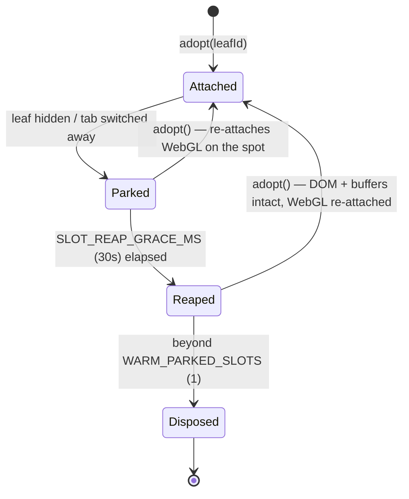

# The terminal renderer pool

A naive terminal app creates one xterm.js instance per tab and keeps it forever. Nexis doesn't, because
that shape has a measurable cost: every instance holds its scrollback buffers, a full DOM subtree, and a
live WebGL context with its own texture atlas — for the entire session, whether or not anyone can see it.
Upstream terax hit exactly this in its 0.8.0 perf pass, chasing a 914 MB webview-RSS report. The pool is
the fix.

The implementation is `src/modules/terminal/lib/rendererPool.ts`.

## Slots, not terminals

The pool owns a bounded set of **slots** (`POOL_MAX_SIZE = 5`). A slot is a real xterm.js `Terminal` plus
its addons — fit, search, serialize, web-links, and optionally WebGL. Slots are *rented* to terminal
leaves rather than owned by them:

The crucial decoupling: **a PTY session is not a slot.** The shell keeps running, its output keeps
arriving, and the session's own state keeps updating regardless of whether a renderer is currently
attached. A leaf without a slot isn't a dead terminal — it's a live terminal nobody is looking at.

## The three states

**Attached.** Visible, WebGL on, receiving writes. What you'd expect.

**Parked.** The leaf still exists but isn't rendered. The slot keeps its xterm instance, DOM, and buffers
so re-adoption is instant, but a 30-second grace timer (`SLOT_REAP_GRACE_MS`) starts.

**Reaped (grace expired).** The slot loses its WebGL context and falls back to the DOM renderer. For
something invisible this costs nothing perceptible, and it buys two things: the texture atlas memory back,
and — more subtly — fewer idle GL contexts. Fragile drivers raise context-loss events roughly in
proportion to how many contexts are live, and the Linux/NVIDIA surface that 1.20.5 fought is exactly that
failure mode. Beyond a small warm set (`WARM_PARKED_SLOTS = 1`), expired slots are disposed outright.

Adoption re-attaches WebGL immediately, so switching back to a long-idle tab doesn't leave you on the slow
renderer.

## WebGL context loss

Browsers can yank a WebGL context at any time — driver reset, GPU switch, memory pressure. The pool
handles this, and distinguishes two cases that look identical at the API level:

- **Involuntary loss** — the driver took it. Recovery is attempted after `WEBGL_RECOVERY_DELAY_MS`
  (250 ms). Repeated involuntary losses feed a thrash heuristic: after `WEBGL_MAX_LOSSES` (3) the pool
  stops re-attaching and stays on the DOM renderer rather than fighting a driver that clearly isn't
  cooperating. A `WEBGL_STABILITY_RESET_MS` (60 s) window of stability clears the counter.
- **Deliberate teardown** — *we* released it, during reaping. This must not count toward the thrash
  heuristic, or normal tab-switching would look like driver failure and permanently downgrade the user to
  the DOM renderer.

That's why deliberate teardown goes through **`disposeSlotWebgl`** rather than dropping the context
directly. If you add a new teardown path, route it through that function.

## Resize, fit, and the SIGWINCH quirk

Two debounces, tuned to different consumers:

- `FIT_DEBOUNCE_MS` (8 ms) — the xterm fit addon recomputing cols/rows. Nearly immediate; the user sees
  reflow as they drag.
- `PTY_RESIZE_DEBOUNCE_MS` (256 ms) — telling the *shell* about the new size. Far lazier on purpose, since
  every notification is an ioctl plus a SIGWINCH the child has to handle, and a drag would otherwise
  deliver hundreds.

There's also a deliberate hack worth knowing about: `kickPty`. The Linux kernel suppresses winsize ioctls
that don't change the size, so a full-screen TUI that was dormant while parked has no reason to repaint —
leaving a stale or blank frame on re-adopt. `kickPty` forces a real SIGWINCH by bumping the row count by
one and restoring it. If you're wondering why the resize path takes a detour through a +1/-1 dance, that's
why.

## Snapshots

Slots serialize their scrollback through the xterm serialize addon, capped at
`SNAPSHOT_SCROLLBACK_CAP = 5000` lines. This feeds two features: instant restore when a parked slot's
xterm has been disposed and the leaf is re-adopted, and cross-restart scrollback restore (covered in
[pty-shell-integration.md](pty-shell-integration.md#scrollback-across-restarts)).

The cap is a deliberate tradeoff — unbounded serialization of a terminal that has scrolled a million lines
is both slow and large on disk.

## Working on the pool

- **`POOL_MAX_SIZE = 5` is not the tab limit.** Tabs are unlimited; five is how many can be *rendered*
  concurrently, which in practice exceeds any realistic split layout.
- **Don't assume a leaf has a slot.** `resolveLeaf` returns `null` legitimately. Code that writes to a
  terminal must handle the no-slot case rather than treating it as an error.
- **Route deliberate GL teardown through `disposeSlotWebgl`** — see above.
- **Terminal state isn't in a Zustand store.** Unlike most of the app, terminal session state lives in
  hooks around the PTY bridge. Don't go looking for a `useTerminalStore`; there isn't one.

## Related

- Vault: [pty](../vault/subsystems/pty.md) (the `rendererPool.ts` entry) · [frontend-modules](../vault/maps/frontend-modules.md)
- Guides: [pty-shell-integration.md](pty-shell-integration.md)
- Constants live at the top of `src/modules/terminal/lib/rendererPool.ts` — check there before trusting
  the numbers in this document.
