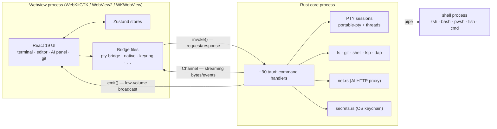
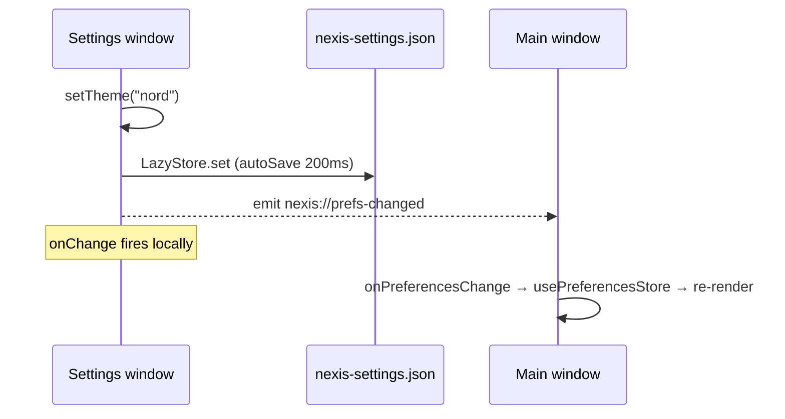

# The two-process model

Everything else in Nexis sits on this split. Read it first.

## The shape

A Tauri app is two processes with very different privileges:

**The webview holds the product logic.** The React app owns UI state, the editor, the entire AI agent
loop, tab management, and the terminal front end. It runs with no ambient authority: it cannot open a
file, spawn a process, or make an arbitrary network request on its own.

**The Rust core holds the capabilities.** Anything privileged is a command handler. That concentration is
deliberate — it's what makes the [security model](security-model.md) enforceable, because there is a
finite, enumerable list of things the UI can ask for.

The authoritative list of commands is the `tauri::generate_handler![...]` macro in `src-tauri/src/lib.rs`.
The [IPC surface map](../vault/maps/ipc-surface.md) groups them into families and names the frontend
bridge file that owns each one.

## Three ways across the seam

Picking the wrong one is a real bug, not a style preference.

**`invoke()` — request/response.** The default. A command call with a JSON-serializable argument and
return value. Fine for anything one-shot: read a file, run a git command, resize a PTY.

**`Channel<T>` — streaming.** Passed *as an argument* to a command, then written to repeatedly by Rust.
This is how PTY output reaches xterm.js (`pty_open` takes `on_data: Channel<Response>` and
`on_exit: Channel<i32>`) and how AI tokens stream in (`ai_http_stream` takes `on_event`). Channels are
point-to-point and cheap per message; use them for anything high-volume.

**`emit()`/`listen()` — global broadcast.** Every window receives it. Reserved for low-volume signals,
almost all of them cross-window state sync: `nexis://prefs-changed`, `nexis://ai-keys-changed`,
`nexis://custom-themes-changed`, and friends. **Never route bulk data through events** — every window
pays to deserialize a message only one of them cares about.

### Convention: one bridge file per family

Frontend `invoke()` calls are confined to a bridge module per command family — `pty-bridge.ts` for PTY,
`ai/lib/native.ts` for fs/git/shell, `ai/lib/keyring.ts` for secrets, and so on. Components call the
bridge, never `invoke("cmd_x")` directly.

This isn't tidiness. Several invariants are enforced by *counting call sites* — the PTY input-ordering
guarantee holds only because `pty_write` has exactly one caller, and there's a tripwire test that fails
if a second one appears. Scattering raw `invoke` calls through components silently dissolves that.

## The main-thread rule

**Tauri runs non-`async` commands on the main thread.** While one runs, the event loop is blocked: the UI
freezes, and every queued IPC call — including the keystroke the user just typed into a terminal — waits
behind it.

So the rule is:

> If a command touches the filesystem, walks a directory tree, or spawns a process, it must be
> `pub async fn` with its body inside `crate::modules::heavy(move || { ... }).await`.

`heavy()` (in `src-tauri/src/modules/mod.rs`) is a `spawn_blocking` wrapper. The fs, shell, ml, workspace,
and crash families all follow this. Git has its own registry-aware `blocking()` helper in
`git/commands.rs`. Commands that take Tauri `State` re-fetch it from an `AppHandle` inside the closure,
because `State` can't cross the closure boundary — `shell_session_open` is the example to copy.

**Don't cargo-cult it the other way.** Commands that only lock a map and return stay sync on purpose:
`pty_resize`, `pty_close`, `shell_bg_*`, `lsp_notify`. Two deliberate exceptions worth knowing:

- `pty_write` is sync *and* must stay that way. It only enqueues onto a channel feeding a per-session
  writer thread; making it async would let rapid keystrokes reorder. See
  [pty-shell-integration.md](pty-shell-integration.md#input-ordering).
- `pty_cwd` is sync because it's a single `/proc` readlink — one non-blocking syscall, not disk I/O.

There's a tripwire test (`heavy`-command audit in `src-tauri/tests/pitfall_invariants.rs`) that catches
new blocking commands that skipped `heavy()`.

## Multiple windows

The main window is not the only webview. The Settings window and any secondary windows opened via
`window/openNewWindow.ts` are **separate webview processes** with their own JS heap, their own Zustand
stores, and their own copy of every hydrated preference.

The consequence bites often enough that it's [pitfall #2](../../CLAUDE.md) in the invariants doc: writing
a preference to disk does *not* update the other window. `LazyStore.onChange` only fires in the process
that wrote. Live sync requires an explicit broadcast, which is why every preference setter routes through
`writePref()` — it persists *and* emits `nexis://prefs-changed`.

A setter that calls `store.set()` directly persists fine and looks correct in single-window testing — the
bug only appears with two windows open. The [prefs propagation flow](../vault/flows/prefs-propagation.md)
walks the full sequence, including the key-map step that drops unmapped keys silently.

Windows are also a capability boundary in Tauri's permission system: `src-tauri/capabilities/default.json`
lists which window labels (`main`, `settings`, `nexis-*`) get which permissions. Secondary windows must
repeat their platform chrome options explicitly — they do not inherit the `tauri.linux.conf.json` /
`tauri.windows.conf.json` overrides.

## What runs where — quick reference

| Concern | Process | Notes |
|---|---|---|
| Terminal rendering | Webview | xterm.js + WebGL; see [renderer pool](terminal-renderer-pool.md) |
| Terminal PTY, shell process | Rust | `portable-pty`, dedicated threads per session |
| Editor, LSP/DAP clients | Webview | Client protocol logic is TS |
| LSP/DAP server processes | Rust | Process management only |
| AI agent loop, prompts, tools | Webview | Vercel AI SDK; Rust is proxy + executor |
| AI provider HTTP | Rust | `net.rs` — avoids CORS, keeps keys out of the webview |
| API keys | Rust | OS keychain via `keyring` crate; never on disk, never in JS memory long-term |
| Git | Rust | Shells out to `git`; output decoded with `from_utf8_lossy` |
| Preferences | Both | Written by either window, synced via event |

## Related

- Vault: [ipc-surface](../vault/maps/ipc-surface.md) · [rust-modules](../vault/maps/rust-modules.md) · [frontend-modules](../vault/maps/frontend-modules.md) · [window-chrome](../vault/subsystems/window-chrome.md)
- Invariants: [CLAUDE.md](../../CLAUDE.md) pitfalls #2 (cross-window sync), #4 (subprocess construction)
