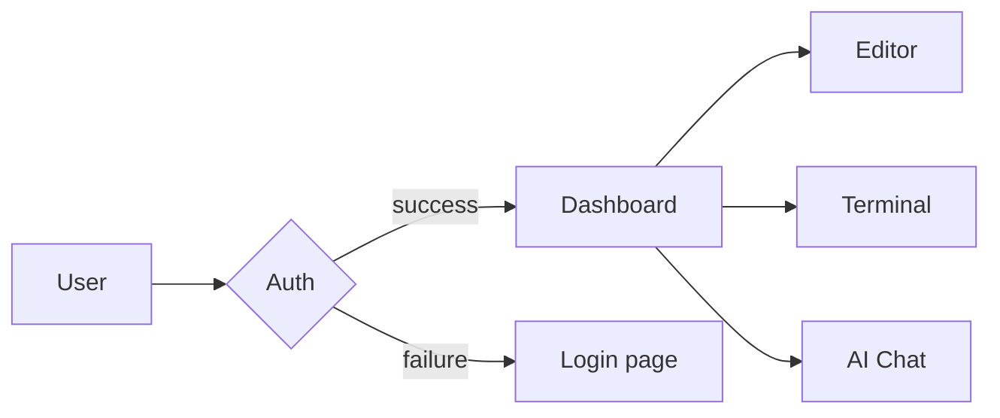
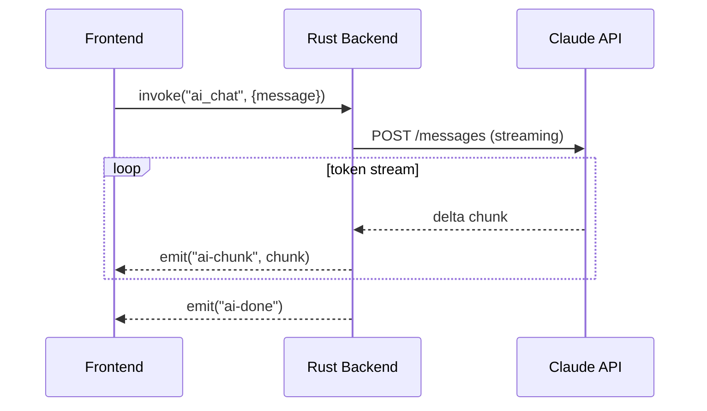
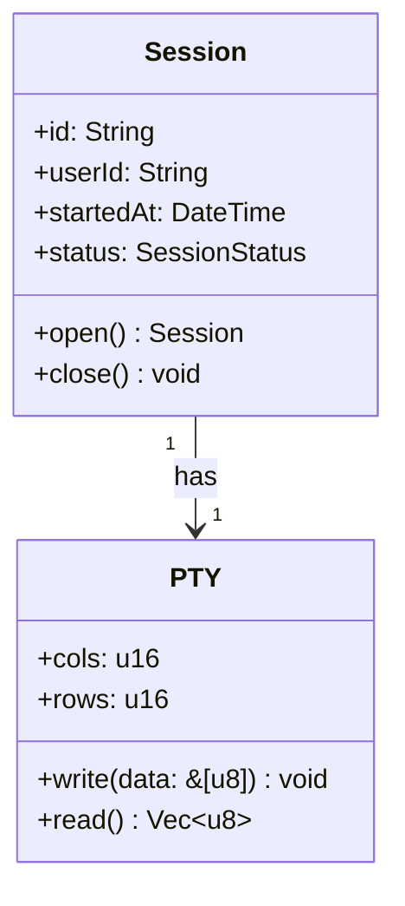

# Test Markdown — Nexis editor playground

> Exercises: headings, emphasis, code, tables, task lists, footnotes,
> definition lists, math (KaTeX), Mermaid diagrams, HTML, alerts.

---

## Headings (H2)

### H3 Heading

#### H4 Heading

##### H5 Heading

###### H6 Heading

---

## Text formatting

Regular paragraph with **bold text**, *italic text*, ***bold italic***, ~~strikethrough~~,
`inline code`, <u>underline</u>, and <mark>highlighted text</mark>.

Superscript: E = mc<sup>2</sup> · Subscript: H<sub>2</sub>O

[External link](https://nexis.dev) · [Relative link](../README.md) · [Anchor](#tables)

Keyboard shortcuts: <kbd>Ctrl</kbd>+<kbd>P</kbd>

---

## Lists

### Unordered

- Item A
  - Nested item A1
  - Nested item A2
    - Deeply nested A2a
- Item B
- Item C

### Ordered

1. First step
2. Second step
   1. Sub-step 2a
   2. Sub-step 2b
3. Third step

### Task list

- [x] Implement terminal module (PTY)
- [x] Add LSP support
- [x] Build DAP debugger
- [x] Git stash manager (v1.3.0)
- [ ] Multi-cursor editing
- [ ] Split pane support
- [ ] Remote SSH sessions

---

## Code blocks

Inline: `const π = Math.PI`

### TypeScript

```typescript
type Result<T, E = Error> =
  | { ok: true;  value: T }
  | { ok: false; error: E }

async function fetchUser(id: string): Promise<Result<User>> {
  try {
    const res = await fetch(`/api/users/${id}`)
    if (!res.ok) throw new Error(`HTTP ${res.status}`)
    return { ok: true, value: await res.json() }
  } catch (error) {
    return { ok: false, error: error as Error }
  }
}
```

### Rust

```rust
use std::sync::Arc;

#[derive(Debug, Clone)]
pub struct Session {
    id:      String,
    user_id: String,
    data:    Arc<RwLock<HashMap<String, Value>>>,
}

impl Session {
    pub fn new(user_id: impl Into<String>) -> Self {
        Self {
            id:      Uuid::new_v4().to_string(),
            user_id: user_id.into(),
            data:    Arc::new(RwLock::new(HashMap::new())),
        }
    }
}
```

### Shell

```bash
#!/usr/bin/env bash
set -euo pipefail

nexis_version=$(cat package.json | jq -r '.version')
echo "Building Nexis v${nexis_version}"

pnpm install --frozen-lockfile
pnpm tauri build --target universal-apple-darwin
```

### Python

```python
from functools import wraps
from typing import Callable, TypeVar

F = TypeVar("F", bound=Callable)

def retry(max_attempts: int = 3, delay: float = 1.0):
    def decorator(fn: F) -> F:
        @wraps(fn)
        def wrapper(*args, **kwargs):
            for attempt in range(1, max_attempts + 1):
                try:
                    return fn(*args, **kwargs)
                except Exception as exc:
                    if attempt == max_attempts:
                        raise
                    time.sleep(delay * 2 ** (attempt - 1))
        return wrapper  # type: ignore
    return decorator
```

### SQL

```sql
WITH ranked AS (
  SELECT
    user_id,
    session_id,
    started_at,
    ROW_NUMBER() OVER (
      PARTITION BY user_id
      ORDER BY started_at DESC
    ) AS rn
  FROM sessions
  WHERE status = 'active'
)
SELECT * FROM ranked WHERE rn = 1;
```

---

## Tables

| Language   | Paradigm            | Typing       | Performance  |
|:-----------|:--------------------|:-------------|:-------------|
| Rust       | Systems / FP        | Static       | ★★★★★        |
| TypeScript | OO / FP             | Static       | ★★★☆☆        |
| Python     | OO / FP             | Dynamic      | ★★☆☆☆        |
| Go         | Concurrent          | Static       | ★★★★☆        |
| Haskell    | Purely functional   | Static       | ★★★★☆        |
| Ruby       | OO / FP             | Dynamic      | ★★☆☆☆        |

### Alignment demo

| Right-aligned | Left-aligned | Center-aligned |
|--------------:|:-------------|:--------------:|
| 1,000         | alpha        | A              |
| 20,000        | beta         | B              |
| 300,000       | gamma        | C              |

---

## Blockquotes

> "Simplicity is prerequisite for reliability."
> — Edsger W. Dijkstra

> **Nested blockquote:**
>
> > "The art of programming is the art of organizing complexity."
> > — Edsger W. Dijkstra

---

## Horizontal rules

---

***

___

---

## Images


With link:
[](https://github.com/rwetz00/nexis)

---

## Footnotes

Nexis uses the Tauri framework[^1] and the ConPTY API[^2] for terminal emulation.

[^1]: Tauri is a framework for building desktop apps with web technology. See [tauri.app](https://tauri.app).
[^2]: ConPTY (Console Pseudo-Console) is the Windows pseudo-terminal API introduced in Windows 10 1809.

---

## Math (KaTeX / MathJax)

Inline math: The area of a circle is $A = \pi r^2$.

Display math:

$$
\int_{-\infty}^{\infty} e^{-x^2}\,dx = \sqrt{\pi}
$$

$$
\mathbf{F} = m\mathbf{a} = \frac{d\mathbf{p}}{dt}
$$

$$
e^{i\pi} + 1 = 0
$$

Bayes' theorem:

$$
P(A \mid B) = \frac{P(B \mid A)\, P(A)}{P(B)}
$$

---

## Mermaid diagrams







---

## Alerts (GitHub Flavored Markdown)

> [!NOTE]
> Nexis stores the ConPTY lifecycle lock in a global `OnceLock` to prevent
> concurrent `CreatePseudoConsole` / `ClosePseudoConsole` calls.

> [!TIP]
> Run `pnpm tauri dev` to start the development server with hot-reload.

> [!IMPORTANT]
> Never commit `.env` files — use `.env.example` as a template.

> [!WARNING]
> Calling `pty_close` without the lifecycle lock will silently blank active
> terminal sessions on Windows (see CLAUDE.md root cause D).

> [!CAUTION]
> Force-pushing to `main` is blocked by branch protection rules.

---

## HTML in Markdown

<details>
<summary><strong>Click to expand: hidden content</strong></summary>

This content is hidden by default. It uses the native `<details>`/`<summary>` HTML elements.

```json
{ "hidden": true, "reason": "demo" }
```

</details>

<table>
  <tr>
    <td>HTML <strong>table</strong></td>
    <td><em>inside</em> Markdown</td>
  </tr>
  <tr>
    <td>Supports</td>
    <td><code>inline code</code> too</td>
  </tr>
</table>

---

*Last updated: 2025-06-01 · [Edit this page](https://github.com/rwetz00/nexis/edit/main/test/test.md)*
